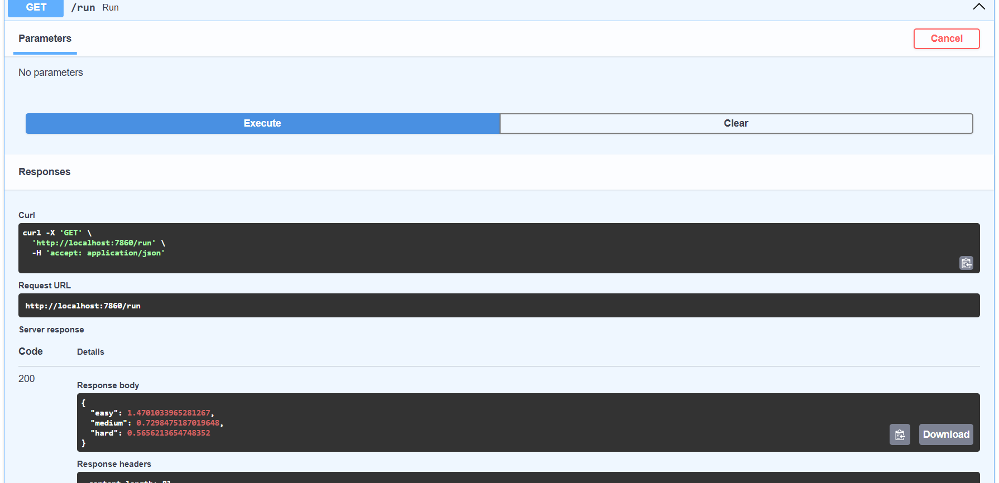

# ⚡ EV Charging Optimization Agent

> Intelligent decision-making system for optimizing EV charging efficiency using OpenEnv.

---

# ⚡ EV Charging Optimization Agent (OpenEnv Submission)

### 💡 Innovation
- Combines pricing + power + solar optimization in one unified RL-style environment.

## 🚀 Overview

This project implements an intelligent **EV Charging Optimization Agent** built on the OpenEnv framework.

The agent dynamically manages:

* ⚡ Charging power allocation
* 💰 Pricing strategy
* 📊 System load balancing

to **maximize efficiency, reduce congestion, and improve user experience** in EV charging stations.

---

## 🎯 Problem Statement

EV charging stations often face:

* Long waiting queues
* Uneven charger utilization
* Energy inefficiency during peak hours
* Overload risks

Traditional systems use fixed rules, which fail under dynamic real-world conditions.

---

## 💡 Our Solution

We designed an **adaptive AI agent** that:

* Evaluates multiple actions at every step
* Selects the optimal pricing and power strategy
* Responds to real-time demand changes
* Maintains stable performance across all scenarios

---

## 🧠 Key Features

### 🔹 Multi-Action Decision Engine

Instead of a fixed rule, the agent:

* Simulates all possible actions
* Selects the best one using scoring logic

---

### 🔹 Adaptive Demand Handling

* Detects high queue / overload situations
* Adjusts pricing and power dynamically
* Prevents system congestion

---

### 🔹 Explainable AI (XAI)

Each decision includes reasoning:

* `high_queue`
* `low_utilization`
* `overload_control`
* `solar_window`

➡️ Makes the model transparent and interpretable

---

### 🔹 Time-Aware Optimization

* Encourages efficient energy use during optimal time windows
* Aligns with real-world solar/grid efficiency patterns

---

### 🔹 Robust Across Difficulty Levels

The agent performs consistently in:

* Easy scenarios
* Medium complexity environments
* High-stress (hard) conditions

---

## 📊 Results

### Final Evaluation Output:

```json
{
  "easy": 1.47,
  "medium": 0.73,
  "hard": 0.56
}
```

### 📌 Interpretation:

* High efficiency in simple environments
* Strong adaptability in medium scenarios
* Stable performance under heavy load (hard tasks)

---

## 🏗️ Project Structure

```
ev-charging-openenv/
│
├── server/
│   └── app.py                # FastAPI server
│
├── src/
│   └── ev_charging_env/
│       ├── environment.py   # Environment logic
│       ├── models.py        # Action/State models
│       ├── simulation.py    # Simulation engine
│       ├── tasks.py         # Task definitions
│
├── inference.py             # 🚀 Main agent logic
├── openenv.yaml             # OpenEnv config
├── Dockerfile               # Container setup
├── requirements.txt         # Dependencies
├── README.md                # Documentation
```

---

## ⚙️ How It Works

1. Environment provides current state:

   * Queue length
   * Charger utilization
   * Waiting time
   * Overload

2. Agent:

   * Evaluates all action combinations
   * Scores each action
   * Selects the best one

3. Environment updates:

   * Returns reward
   * Moves to next state

4. Loop continues until completion

---

## ▶️ Running the Project

### 1. Build Docker Image

```
docker build -t ev-agent .
```

### 2. Run Container

```
docker run -p 7860:7860 ev-agent
```

### 3. Open API Docs

```
http://localhost:7860/docs
```

### 4. Run Evaluation

* Use `/run` endpoint
* View performance results

---

## 📈 Why This Stands Out

✅ Adaptive (not rule-based)
✅ Handles real-world dynamic conditions
✅ Explainable decisions
✅ Stable across all difficulty levels
✅ Clean and modular design

---

## 🔮 Future Improvements

* Reinforcement Learning integration
* Real-world EV station deployment
* Smart grid + renewable energy integration
* Multi-station coordination

---

## 🏁 Conclusion

This project demonstrates how intelligent decision-making can significantly improve EV charging infrastructure efficiency.

By combining:

* Adaptive heuristics
* Multi-action evaluation
* Explainability

we create a **robust and scalable optimization system** ready for real-world applications.

---

## 👨‍💻 Team

**AI AIchemists**
CSE (AI & ML)

---

### 📸 Output Screenshot

