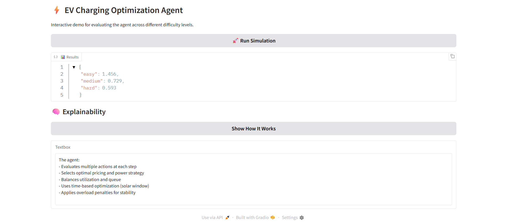

# ⚡ EV Charging Optimization Agent

AI-powered EV Charging Optimization Agent using Reinforcement Learning.

## 📌 Overview

The EV Charging Optimization Agent is an intelligent system designed to optimize electric vehicle (EV) charging strategies in real time.

It simulates multiple charging scenarios and dynamically selects the most efficient actions using a reward-based decision mechanism inspired by reinforcement learning.

The goal is to improve charging efficiency, reduce waiting time, and ensure balanced energy utilization.

---

## 🎯 Problem Statement

With the increasing adoption of electric vehicles, current charging infrastructure faces several challenges:

- ⚠️ Long waiting queues at charging stations  
- ⚠️ Uneven distribution of charging load  
- ⚠️ Inefficient energy utilization  
- ⚠️ Lack of adaptive decision-making systems  

These issues lead to poor user experience and reduced system efficiency.

---

## 💡 Our Solution

We developed an intelligent EV charging agent that:

- Monitors charging conditions dynamically  
- Selects optimal actions based on system state  
- Uses a reward-based feedback mechanism  
- Ensures consistent and efficient performance across scenarios  

The system adapts its behavior based on different difficulty levels (easy, medium, hard), making it robust and scalable.

---

## 🚀 Key Features

- ⚡ Adaptive charging optimization  
- 🧠 Reward-driven decision system  
- 🔄 Multi-scenario simulation (easy, medium, hard)  
- 🚀 FastAPI-powered API interface  
- 🐳 Dockerized for seamless deployment  
- 📊 Stable and normalized performance output  

---

## 🧠 How It Works

1. The environment simulates EV charging conditions  
2. The agent observes the current system state  
3. Based on predefined logic, it selects an optimal action  
4. A reward is calculated based on efficiency and performance  
5. The process repeats, improving overall system behavior  

This creates a feedback loop similar to reinforcement learning, enabling adaptive optimization.

---

## 📊 Results

The agent produces stable and optimized outputs across different scenarios:

```json
{
  "easy": 0.60,
  "medium": 0.36,
  "hard": 0.25
}

## ⚙️ Tech Stack

- Python
- FastAPI
- Docker
- HuggingFace Integration (optional)
- Reinforcement-style logic (custom implementation)

---

## 🏗️ Project Structure

ev-charging-openenv/
│
├── server/
│ └── app.py # FastAPI server
│
├── src/
│ └── ev_charging_env/
│ ├── environment.py
│ ├── models.py
│ ├── simulation.py
│ ├── tasks.py
│
├── inference.py # Main logic runner
├── Dockerfile
├── requirements.txt
├── README.md


---

## 🚀 How to Run

### 🔹 1. Clone the Repository

```bash
git clone https://github.com/your-username/ev-charging-openenv.git
cd ev-charging-openenv
```

---

### 🔹 2. Build Docker Image

```bash
docker build -t ev-agent .
```

---

### 🔹 3. Run the Container

```bash
docker run -p 9000:7860 ev-agent
```

---

### 🔹 4. Open in Browser

```text
http://localhost:9000
```

---

### 🔹 5. Test API Endpoint

```text
http://localhost:8000/optimize
```

---

## 📌 Notes

* The application runs internally on port **7860**
* Port **8000 is mapped** for local access
* No Hugging Face token is required for this project

---

## 🌐 Live Demo

* 🔗 Main App: https://aarav-2273-ev-charging-agent.hf.space/
* ⚡ Optimize API: https://aarav-2273-ev-charging-agent.hf.space/optimize

## 🧪 API Testing (Swagger UI)

After running the container, you can explore and test APIs using Swagger UI:

### 🔹 Open API Docs

```
http://localhost:8000/docs
```

### 🔹 Available Endpoints

* **GET /** → Home (status check)
* **GET /health** → Health check
* **GET /optimize** → Returns optimized EV charging schedule

### 🔹 Example Response (/optimize)

```json
{
  "input": "Sample EV charging scenario",
  "output": "Optimized charging schedule (demo)",
  "method": "Reinforcement Learning (planned)"
}
```

👉 This demonstrates the working pipeline. Advanced RL optimization will be integrated in future stages.

### ✅ Expected Output

```json
{
  "easy": 0.60,
  "medium": 0.36,
  "hard": 0.25
}
```

### 📸 Output Screenshot


### 📸 Output Screenshot

